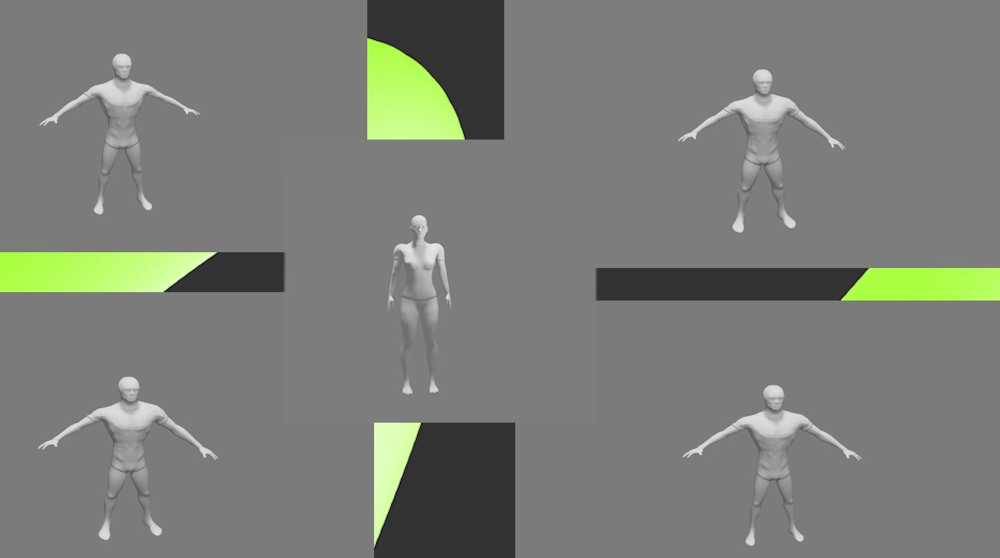
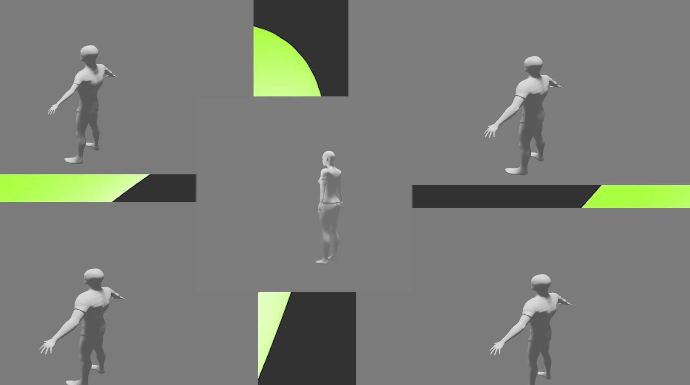
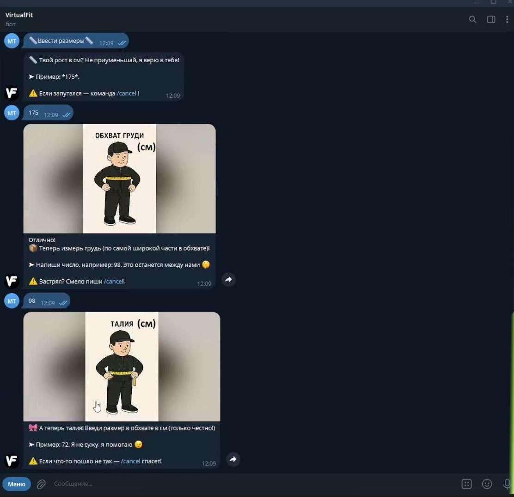

# 👗 VirtualFit — 3D-примерка одежды на основе параметров тела


<table>
  <tr>
    <td></td>
    <td></td>
  </tr>
  <tr>
    <td></td>
    <td></td>
  </tr>
</table>


**VirtualFit** — это программное обеспечение и веб-сервис для генерации 3D-моделей одежды на основе пользовательских параметров. Сервис ориентирован на разработчиков, интеграторов и технические команды, создающие решения для fashion-ретейла, маркетплейсов и визуализации одежды.

---

## 🚀 О проекте

VirtualFit — это backend- и frontend-решение, автоматизирующее процесс виртуальной примерки одежды. Пользователь взаимодействует с Telegram-ботом или веб-интерфейсом, а на сервере запускается пайплайн, включающий нейросеть и 3D-визуализацию в Blender.

---

## 🧱 Архитектура

Пользователь → Telegram-бот / Web UI

Backend (Python, FastAPI)

Нейросеть IMAGDressing → Blender Pipeline

Видео / Preview


---

## ⚙️ Технологии

- 🧠 **Нейросеть IMAGDressing** — автоматическая примерка одежды на цифрового аватара
- 🧩 **Blender API** — генерация 3D-модели и рендеринг видео / GLTF
- 🤖 **Telegram Bot API** — взаимодействие с пользователем через бота

---

## 📦 Возможности

- Загрузка фото одежды и параметров тела
- Генерация 3D-модели с одеждой и вращающимся видео
- Экспорт в `.mp4` и другие форматы
- Web API для интеграции с другими платформами

---

## 🧪 MVP и статус

- ✅ Протестирован MVP на небольшой группе пользователей
- ✅ Получены положительные отзывы
- ⏳ Ведётся разработка Web-интерфейса и оптимизация пайплайна

---

## 📈 Планы развития

- 📱 Создание нативного мобильного приложения
- 🌐 Интеграция с маркетплейсами через SDK и API
- 💾 Расширение облачной инфраструктуры
- 🎯 Оптимизация pipeline для пакетной обработки B2B

---


## 💬 Контакты
Telegram: @VitualFit_bot

Email: virtualfit@gmail.com

## 🛠️ Как использовать (базовый пример)

```bash
# Клонировать репозиторий
git clone https://github.com/your-org/virtualfit.git

# 2. Клонировать IMAGDressing в корень проекта
git clone https://github.com/muzishen/IMAGDressing.git

# 3. Скачать базовые модели из Hugging Face

Скачайте файлы отсюда:
📦 https://huggingface.co/feishen29/IMAGDressing

Разместите веса моделей в ckpt в корне проекта. Если такой папки нет - создайте её.


# 4. Установить зависимости

cd virtualfit

pip install -r requirements.txt

# 5. Запустить backend
python app/VirtualFit_tg_bot.py

