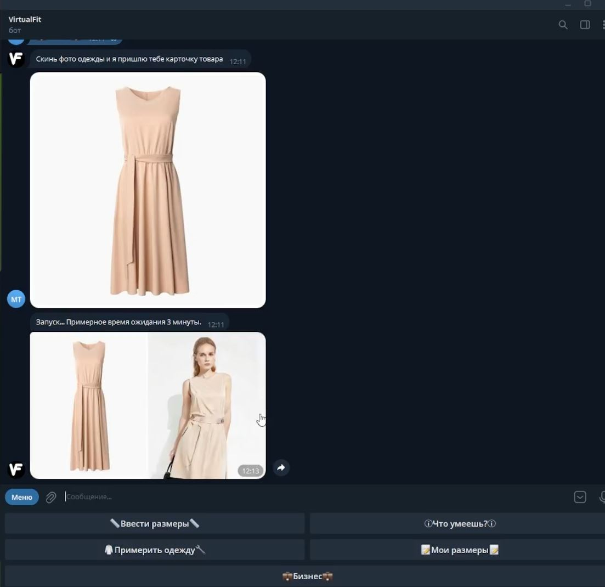

# 👗 VirtualFit — 3D Clothing Try-On Based on Body Measurements

<table>
  <tr>
    <td></td>
    <td></td>
  </tr>
  <tr>
    <td></td>
    <td></td>
  </tr>
</table>

**VirtualFit** is a software and web service for generating 3D clothing models based on user body parameters.  
The service is aimed at developers, integrators, and technical teams creating solutions for fashion retail, marketplaces, and garment visualization.

---

## 🚀 About the Project

VirtualFit is a backend and frontend solution that automates the virtual try-on process.  
Users interact via a Telegram bot or web interface, while the server runs a pipeline that includes a neural network and 3D visualization in Blender.

---

## 🧱 Architecture

**User → Telegram Bot / Web UI → Backend (Python, FastAPI) → IMAGDressing Neural Network → Blender Pipeline → Video / Preview**

---

## ⚙️ Technologies

- 🧠 **IMAGDressing Neural Network** — automatic clothing try-on on a digital avatar  
- 🧩 **Blender API** — 3D model generation and video/GLTF rendering  
- 🤖 **Telegram Bot API** — user interaction via Telegram

---

## 📦 Features

- Upload clothing images and body measurements  
- Generate a 3D model with clothing and a rotating preview  
- Export to `.mp4` and other formats  
- Web API for integration with other platforms

---

## 🧪 MVP & Status

- ✅ MVP tested with a small user group  
- ✅ Positive feedback received  
- ⏳ Web interface and pipeline optimization in progress

---

## 📈 Roadmap

- 📱 Develop a native mobile app  
- 🌐 Integration with marketplaces via SDK and API  
- 💾 Expand cloud infrastructure  
- 🎯 Optimize the pipeline for batch B2B processing

---

## 💬 Contact

Telegram: [@VirtualFit_bot](https://t.me/VirtualFit_bot)  
Email: virtualfit@gmail.com

## 👨‍💻 Developers

- Og-Grig: https://github.com/Og-Grig
- Alex-Doom: https://github.com/Alex-Doom
- Vagim12: https://github.com/Vagim12
- Favck: https://github.com/Favck
- VoltusV: https://github.com/VoltusV5

---

## 🛠️ How to Use (Basic Example)

```bash
# 1. Clone this repository
git clone https://github.com/your-org/virtualfit.git

# 2. Clone IMAGDressing into the project root
git clone https://github.com/muzishen/IMAGDressing.git

# 3. Download base models from Hugging Face

Download the checkpoint files from:  
📦 https://huggingface.co/feishen29/IMAGDressing

Place the model weights into the `ckpt` folder in the project root.  
If the folder doesn’t exist, create it.

# 4. Install dependencies
cd virtualfit
pip install -r requirements.txt

# 5. Run the backend
python app/VirtualFit_tg_bot.py
